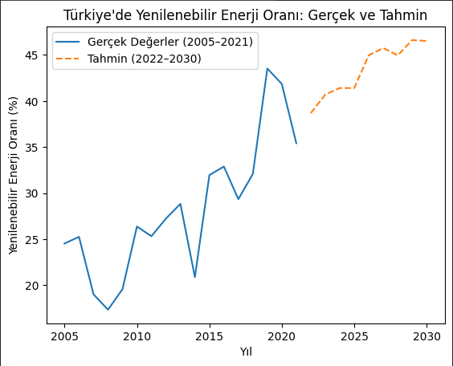

# Renewable Energy Forecast — Turkey (2005–2030)

Predicting Turkey's renewable energy ratio using multivariate Linear Regression
with real historical data (2005–2021) and forecasting through 2030.

## Overview

This project analyzes Turkey's renewable energy trends using three key indicators
and builds a machine learning model to forecast future ratios.

## Dataset Features

| Feature | Description |
|---|---|
| `Yil` | Year (2005–2021) |
| `Yenilenebilir_Enerji_Orani` | Renewable energy ratio (%) |
| `Kisi_Basi_GSYH` | GDP per capita (USD) |
| `Kisi_Basi_Elektrik_Tuketimi` | Electricity consumption per capita (kWh) |

## Model

- **Algorithm:** Multivariate Linear Regression
- **Libraries:** scikit-learn, pandas, numpy, matplotlib
- **Input:** Year, GDP per capita, electricity consumption
- **Output:** Renewable energy ratio (%)

## Results



## How to Run

```bash
pip install numpy pandas matplotlib scikit-learn openpyxl
python kod_dosyasi.py
```

## Tech Stack


